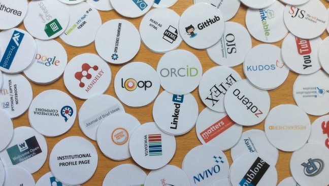

# Real-life Open Science workflows: use and interoperability of research tools 
- [Mozfest2016](https://mozillafestival.org/) session using data from our recent [global survey on Innovations in Scholarly Communication] (http://101innovations.wordpress.com) 

## The idea
We will look at how Open Science practices can be combined into a full Open Science workflow. We also want to come up with concrete ideas to improve the use and interoperability of Open Science tools, so that scholars and scientists experience less obstacles in using these.

## What will we be doing? Tell me more!
There are currently many Open Science tools and platforms available, and we want to explore to which degree researchers can and do employ these in a full Open Science workflow. During MozFest, we would like to do this together using the results of our survey (> 20K respondents), which not only asked about support for Open Science but also about active use of platforms, tools and websites for 17 research activities and our database of >600 research tools. You can contribute with your experience in using research tools, with your ideas on what makes open science tick and with your skills in analysing the survey data and doing some technical appraisal of Open Science tools and platforms.
You can also have a look at our [open canvas](https://docs.google.com/spreadsheets/d/1v6oeOfoRqIt7L_Zzel0ECSyVlCDfBwNouRn5yhz4mBU/edit?usp=sharing).

## How can I get involved?
* Come to our [session](https://app.mozillafestival.org/#_session-338)! It's on Saturday afternoon (3:15-5:15 pm) at floor 9, room 903. 
* In our [Contributing guidelines](CONTRIBUTING.md) you can read more about the goals and activities during the session. 
* Check out the [Mozilla Community Participation Guidelines](CODE_OF_CONDUCT.md) which applies to all facilitators and participants of this session.

## Want to know more?
To read more about the background and goals of this project, and about a related workshop we did on Open Science workflows, you can read the following blog posts:
- [How researchers are getting to grip with the myriad of new tools](http://blogs.lse.ac.uk/impactofsocialsciences/2015/11/11/101-innovations-in-scholarly-communication/) (guest post on LSE blog)
- [Full speed ahead with Open Science](https://im2punt0.wordpress.com/2016/10/22/full-speed-ahead-with-open-science/) (post on our library blog)

## Useful links during the session
- The [session notes](https://public.etherpad-mozilla.org/p/mozfest-2016-real-life-open-science-workflows--use) - etherpad for use during the Mozfest session
- The project [Innovations in Scholarly Communication] (https://101innovations.wordpress.com/about-1/)
- The [survey dataset on Kaggle] (https://www.kaggle.com/bmkramer/101-innovations-research-tools-survey) where data can be downloaded and scripts can be written, executed and shared
- The [400+ tools database](http://bit.ly/innoscholcomm-list) with information on currently over 600 online scholarly communication tools across the research cycle 

